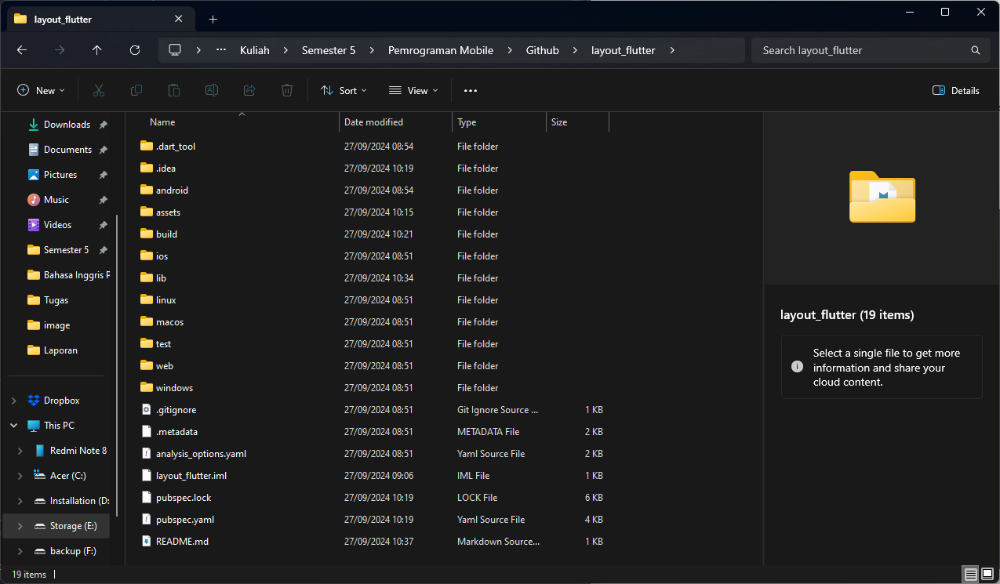
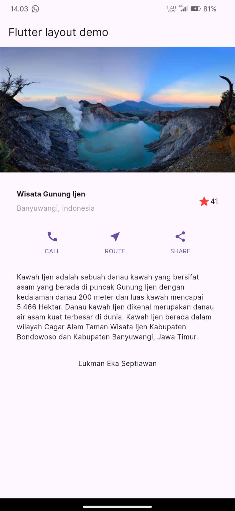

# Nama   : Lukman Eka Septiawan
# Kelas  : TI-3C
# NIM    : 2241720049

## Praktikum 1
### Langkah 1: Buat Project Baru

### Langkah 2: Buka file lib/main.dart
```dart
class MyApp extends StatelessWidget {
  const MyApp({super.key});

  @override
  Widget build(BuildContext context) {
    return MaterialApp(
      title: 'Flutter layout: Lukman Eka Septiawan / 2241720049',
      home: Scaffold(
        appBar: AppBar(
          title: const Text('Flutter layout demo'),
        ),
        body: const Center(
          child: Text('Hello World'),
        ),
      ),
    );
  }
}
```

>Kode di atas adalah contoh aplikasi Flutter menggunakan stateless widget MyApp, yang membangun struktur dasar aplikasi dengan MaterialApp dan Scaffold. Aplikasi ini menampilkan judul "Flutter layout demo" di AppBar dan teks "Hello World" di bagian tengah layar menggunakan widget Center dan Text. Widget MaterialApp juga memiliki properti title
### Langkah 3: Identifikasi layout diagram
Langkah pertama adalah memecah tata letak menjadi elemen dasarnya:

1. Identifikasi baris dan kolom.
2. Apakah tata letaknya menyertakan kisi-kisi (grid)?
3. Apakah ada elemen yang tumpang tindih?
4. Apakah UI memerlukan tab?
5. Perhatikan area yang memerlukan alignment, padding, atau borders.

### Langkah 4: Implementasi
```dart
Widget titleSection() {
    return Container(
      padding: const EdgeInsets.all(32),
      child: Row(
        children: [
          Expanded(
            /*Soal 1*/
            child: Column(
              crossAxisAlignment: CrossAxisAlignment.start,
              children: [
                /*Soal 2*/
                Container(
                  padding: const EdgeInsets.only(bottom: 8),
                  child: const Text(
                    'Wisata Gunung Ijen',
                    style: TextStyle(
                      fontWeight: FontWeight.bold,
                    ),
                  ),
                ),
                const Text(
                  'Banyuwangi, Indonesia',
                  style: TextStyle(color: Colors.grey),
                ),
              ],
            ),
          ),
          /*Soal 3*/
          const Icon(
            Icons.star,
            color: Colors.red,
          ),
          const Text('41')
        ],
      ),
    );
  }
```

> Kode di atas adalah fungsi titleSection() yang mengembalikan widget Container untuk menampilkan judul dan informasi lokasi dalam layout Flutter. Container ini diberi padding 32 piksel dan di dalamnya terdapat Row untuk menyusun widget secara horizontal. Bagian pertama dalam Row adalah Expanded yang berisi Column dengan crossAxisAlignment: CrossAxisAlignment.start, yang berfungsi menyusun teks secara vertikal.

## Praktikum 2
### Langkah 1: Buat methode Column _buildButtonColumn
```dart
 Column _buildButtonColumn(Color color, IconData icon, String label) {
    return Column(
      mainAxisSize: MainAxisSize.min,
      mainAxisAlignment: MainAxisAlignment.center,
      children: [
        Icon(icon, color: color),
        Container(
          margin: const EdgeInsets.only(top: 8),
          child: Text(
            label,
            style: TextStyle(
              fontSize: 12,
              fontWeight: FontWeight.w400,
              color: color,
            ),
          ),
        )
      ],
    );
  }
```
> Kode di atas adalah sebuah fungsi yang mengembalikan widget Column untuk membuat sebuah tombol dengan ikon dan label. Fungsi ini menerima tiga parameter: warna (Color), ikon (IconData), dan label (teks). Di dalam Column, ikon ditampilkan terlebih dahulu dengan warna yang ditentukan, lalu diikuti oleh sebuah Container yang memiliki margin atas sebesar 8 piksel, berisi teks label dengan ukuran font 12, ketebalan font w400 (normal), dan berwarna sesuai parameter warna yang diterima.

### Langkah 2: Buat Widget buttonSection
```dart
Color color = Theme.of(context).primaryColor;
    Widget buttonSection = Row(
      mainAxisAlignment: MainAxisAlignment.spaceEvenly,
      children: [
        _buildButtonColumn(color, Icons.call, 'CALL'),
        _buildButtonColumn(color, Icons.near_me, 'ROUTE'),
        _buildButtonColumn(color, Icons.share, 'SHARE'),
      ],
    );
```
> Variabel color menyimpan warna utama aplikasi dengan mengambilnya dari konteks theme menggunakan Theme.of(context).primaryColor. Kemudian, Widget buttonSection adalah sebuah Row yang menyusun tiga tombol secara horizontal.

### Langkah 3: Tambah button section ke body
```dart
 return MaterialApp(
      debugShowCheckedModeBanner: false,
      title: 'Flutter layout: Lukman Eka Septiawan / 2241720049',
      home: Scaffold(
        appBar: AppBar(
          title: const Text('Flutter layout demo'),
        ),
        body: Center(
          child: ListView(
            children: [
              titleSection(),
              buttonSection,
            const Center(
              child: Text('Lukman Eka Septiawan'),
            ),
            ],
          ),
        ),
      )
    );
```
> Penambahakn kode di atas memanggil widget button yang akan ditampilkan

## Praktikum 3
### Langkah 1: Buat Widget textSection
```dart
    Widget textSection = Container(
      padding: const EdgeInsets.all(32),
      child: const Text(
        'Kawah Ijen adalah sebuah danau kawah yang bersifat asam yang berada '
        'di puncak Gunung Ijen dengan kedalaman danau 200 meter dan '
        'luas kawah mencapai 5.466 Hektar. Danau kawah Ijen dikenal merupakan '
        'danau air asam kuat terbesar di dunia. Kawah Ijen berada dalam wilayah '
        'Cagar Alam Taman Wisata Ijen Kabupaten Bondowoso dan Kabupaten Banyuwangi, Jawa Timur.',
        softWrap: true,
      ),
    );
```
> Kode di atas membuat sebuah Widget bernama textSection, yang merupakan sebuah Container berisi teks deskriptif tentang Kawah Ijen. Container ini memiliki padding sebesar 32 piksel di sekelilingnya untuk memberikan ruang di sekitar teks. Di dalamnya terdapat widget Text yang menampilkan penjelasan tentang Kawah Ijen.

### Langkah 2: Tambahkan variabel text section ke body
```dart
return MaterialApp(
        debugShowCheckedModeBanner: false,
        title: 'Flutter layout: Lukman Eka Septiawan / 2241720049',
        home: Scaffold(
          appBar: AppBar(
            title: const Text('Flutter layout demo'),
          ),
          body: Center(
            child: ListView(
              children: [
                titleSection(),
                buttonSection,
                textSection,
                const Center(
                  child: Text('Lukman Eka Septiawan'),
                ),
              ],
            ),
          ),
        )
    );
```
> Penambahakn kode di atas digunakan untuk memanggil widget textSection yang berisi tentang deskriptif dari Kawah Ijen.

## Praktikum 4
### Langkah 1: Siapkan aset gambar
```dart
  assets:
    - assets/images/
```
> Menambahkan kode pada file pubspec.yaml untuk menambahkan aset gambar.

### Langkah 2: Tambahkan gambar ke body
```dart
return MaterialApp(
        debugShowCheckedModeBanner: false,
        title: 'Flutter layout: Lukman Eka Septiawan / 2241720049',
        home: Scaffold(
          appBar: AppBar(
            title: const Text('Flutter layout demo'),
          ),
          body: Center(
            child: ListView(
              children: [
                Image.asset(
                  'assets/images/ijen.png',
                  width: 600,
                  height: 240,
                  fit: BoxFit.cover,
                ),
                titleSection(),
                buttonSection,
                textSection,
                const Center(
                  child: Text('Lukman Eka Septiawan'),
                ),
              ],
            ),
          ),
        )
    );
```
> Penambahan kode di atas digunakan untuk menampilkan gambar yang sudah disiapkan sebelumnya.

### Langkah 3: Terakhir, ubag menjadi ListView
```dart
return MaterialApp(
        debugShowCheckedModeBanner: false,
        title: 'Flutter layout: Lukman Eka Septiawan / 2241720049',
        home: Scaffold(
          appBar: AppBar(
            title: const Text('Flutter layout demo'),
          ),
          body: Center(
            child: ListView(
              children: [
                Image.asset(
                  'assets/images/ijen.png',
                  width: 600,
                  height: 240,
                  fit: BoxFit.cover,
                ),
                titleSection(),
                buttonSection,
                textSection,
                const Center(
                  child: Text('Lukman Eka Septiawan'),
                ),
              ],
            ),
          ),
        )
    );
```
> Perubahan kode di atas digunakan untuk  membuat tata letak berbasis list yang dapat discroll secara vertikal.

# Hasil Akhir 
